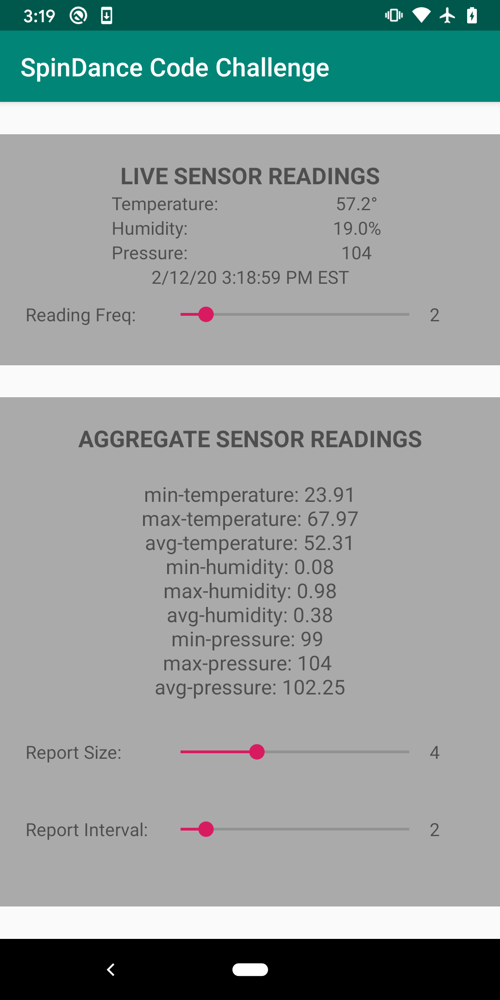
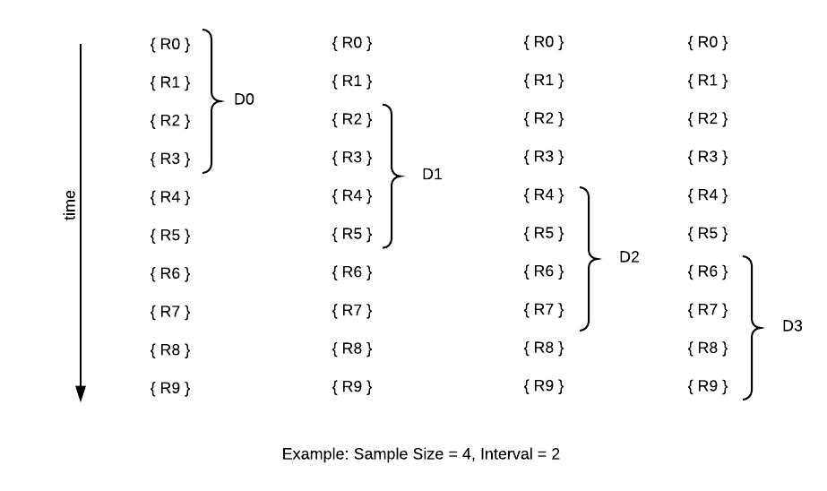

# spindance.code-challenge
## Welcome to the SpinDance Code Challenge!

We have a customer that has a periphery device connected to their phone that collects weather data. The device ouputs readings of temperature, humidity, and pressure at some regular interval. The customer would like to build a presentation layer for their app to display the data, prodivde some insights into it, and allow them to adjust some settings for their device.

For this challenge, you will be building this tool.

This is your private repo. This is where you will commit and push
 your source code, unit tests, and instructions for how to build, test, and run your solution to this challenge. Keep
 in mind we will test your application with various inputs, not just what is provided in this repository. 
  
## Instructions
1. Using the base application provided in the repo, build a front-end for the user that meets the requirements specified below.
1. Commit and push to this repository your source code, unit tests, and instructions for how to build, test, and run your application.
1. Document assumptions you make during implementation in code comments. These will serve as points of discussion about your solution.

## Requirements

1. Using the `SensorReader.kt` reactive publisher provided, build a front end screen that looks like this example:
    
1. The `Live Sensor Readings` section should consume the live weather data and allow the user to adjust the frequency at which they are published.
1. The `Aggregate Sensor Readings` section should
    1. Provide a user configurable way to set the sample size window, which specifies the number of readings included in each diagnostics report. (Ex. last 4 readings).
    1. Provide a user configurable way to set the report interval, which specifies how often the report should be generated (Ex. every 2 readings)

        

        *The above example shows a few successive diagnostics reports D0-D3 generated over successive readings R0-R9*  

    1. Only generate diagnostics reports once enough readings have been accumulated to fill a sample size window.
    1. Compute and display diagnostics data.
    1. Diagnostics data shall include the min, max, and average values for a sample
    1. Diagnostics data shall include the latest timestamp of the readings used in the report.
